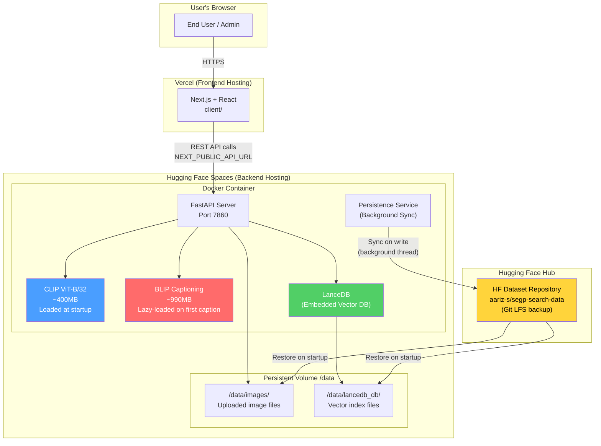
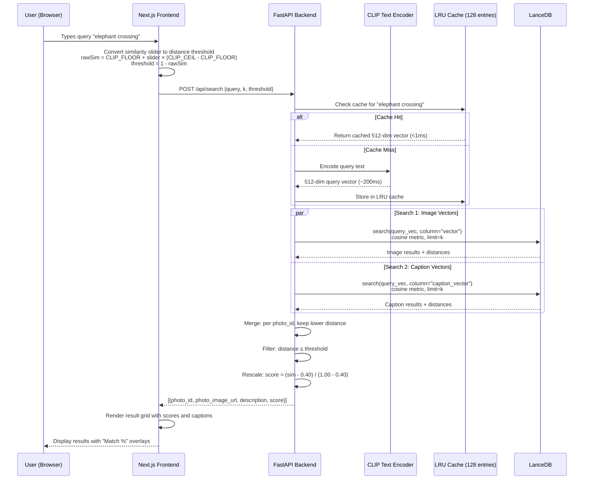
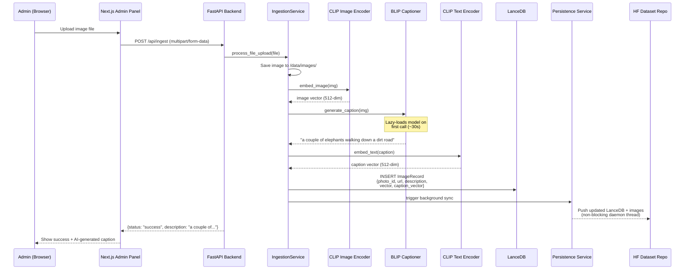
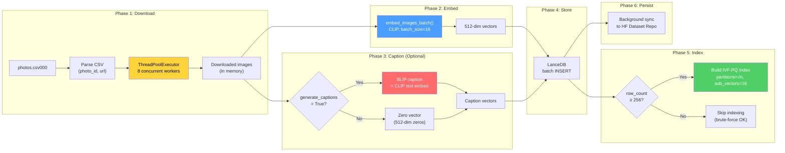
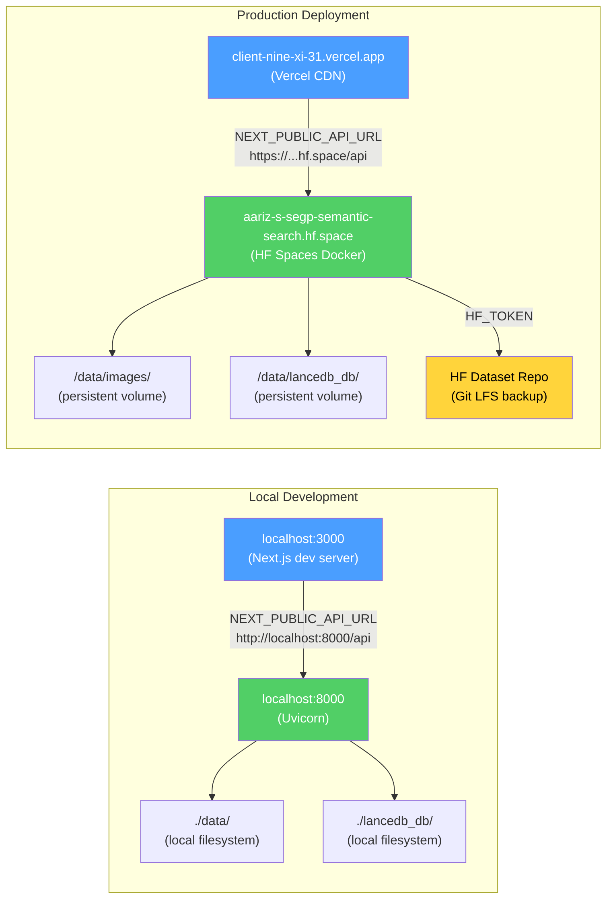

# Architecture Diagrams

These diagrams are written in Mermaid syntax. To render them:
- Paste into https://mermaid.live for PNG/SVG export
- Or use a Mermaid-compatible Markdown viewer (VS Code with Mermaid extension, GitHub, etc.)

---

## 1. System Deployment Architecture

Shows where each component is hosted and how they communicate.

---

## 2. Search Data Flow

Shows what happens when a user submits a search query.

---

## 3. Ingestion Data Flow (Single Image Upload)

Shows what happens when an admin uploads an image.

---

## 4. Ingestion Data Flow (Bulk CSV)

Shows the optimised pipeline for bulk ingestion.

---

## 5. Dual-Model Architecture (CLIP + BLIP)

Shows how the two AI models work together.

```mermaid
graph TB
    subgraph "At Ingestion Time"
        IMG[Uploaded Image] --> CLIP_IMG["CLIP Image Encoder<br/>(ViT-B/32)"]
        IMG --> BLIP_CAP["BLIP Captioner<br/>(blip-image-captioning-base)"]
        CLIP_IMG --> VEC1["image vector<br/>(512-dim)"]
        BLIP_CAP --> CAP["Caption text<br/>'a couple of elephants<br/>walking down a dirt road'"]
        CAP --> CLIP_TXT["CLIP Text Encoder"]
        CLIP_TXT --> VEC2["caption vector<br/>(512-dim)"]

        VEC1 --> RECORD["ImageRecord in LanceDB"]
        VEC2 --> RECORD
        CAP --> RECORD
    end

    subgraph "At Search Time"
        QUERY["User query:<br/>'elephant crossing'"] --> CLIP_Q["CLIP Text Encoder"]
        CLIP_Q --> QVEC["query vector<br/>(512-dim)"]

        QVEC --> S1["Search 1:<br/>query vs image vectors<br/>(cross-modal)"]
        QVEC --> S2["Search 2:<br/>query vs caption vectors<br/>(same-modal)"]

        S1 --> MERGE["Merge:<br/>best score per image"]
        S2 --> MERGE
        MERGE --> RESULTS["Ranked results<br/>with rescaled scores"]
    end

    style CLIP_IMG fill:#4a9eff,color:#fff
    style CLIP_TXT fill:#4a9eff,color:#fff
    style CLIP_Q fill:#4a9eff,color:#fff
    style BLIP_CAP fill:#ff6b6b,color:#fff
    style MERGE fill:#51cf66,color:#fff
```

---

## 6. Environment Variable Configuration

Shows how the same codebase works locally and deployed.

